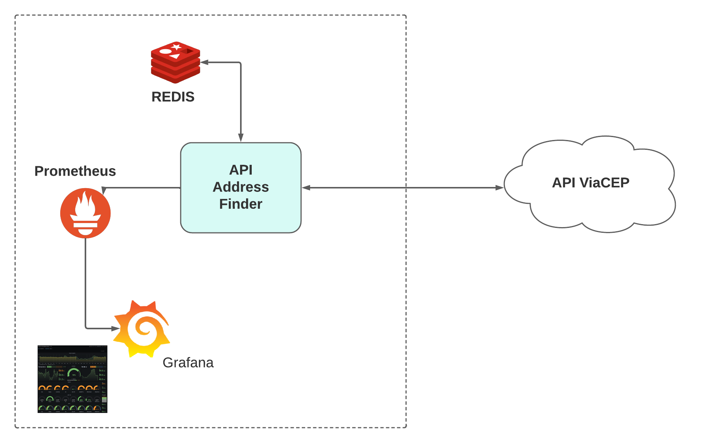

# API Address-finder

@author: João Carlos Gonçalves

Recursos disponíveis para acesso via API:
  * Consulta de endeços por CEP

## Resumo
 * API desenvolvida para realizar a consulta de endereço por cep. 
   Faz uso de cache (redis) para reduzir o número de consultas na api
   ViaCEP. Usa o prometheus para coletar métricas que são usadas
   para alimentar os dashboards do grafana.

## Arquitetura

  
  <figcaption>Fig.1 - Esquema Arquitetural.</figcaption>

## Métodos
Requisições para a API devem seguir os padrões:

| Método | Descrição |
|---|---|
| `GET` | Retorna o endeço referente ao cep informado. |

.. WIP

